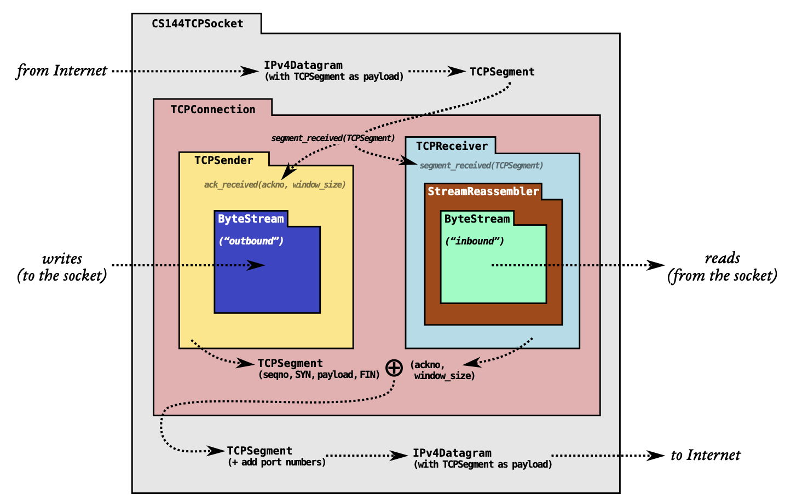
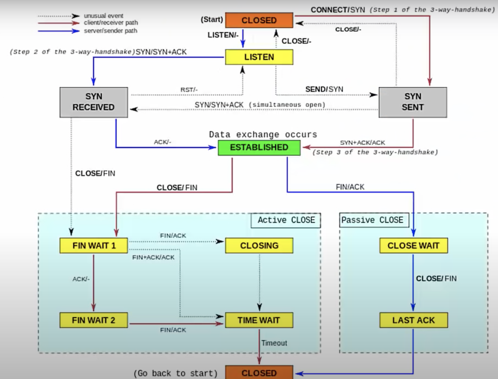
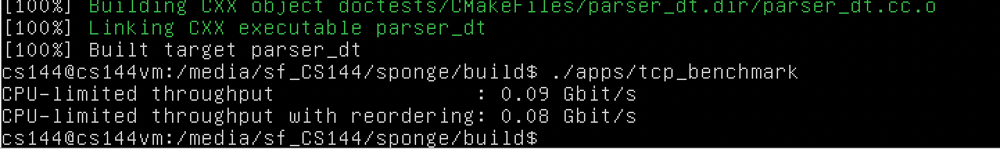

## TCP Protocol Implementation

---

###### Author: Yukun Jiang
###### Init Data: Dec 25, 2021
###### Built Date: Jan 10, 2021
Many thanks to [wine99](https://github.com/wine99/cs144-20fa) and [comzyh](https://github.com/comzyh/TCP-Lab) on github. During my implementation and debugging phase, I referenced and gained insights from their repositories respectively. Appreciated!

---

#### Overall

This is the implementation of a **TCP (Transmission Control Protocol)** in modern C++ called **Sponge**, which helps to establish a **bi-directional reliable in-order data transfer** between two endpoints on the Transfer layer in term of the 4-layer network abstraction. The original starter scaffolding and helper class codes are from [Stanford CS144: Introduction to Computer Networking](https://cs144.github.io) semester-long lab project. I implemented this lab during the winter break of 2021 to help me:
+ have a deep understanding of the network protocol
+ practise developing non-trivial scale project in modern C++

The overall design is illustrated in the picture below. The details and key points will be elaborated in the next sections. 

(picture source: https://cs144.github.io)

---

#### Highlights

As can be seen from the design picture above, the Sponge TCP Protocol is divided into a few well-thought modules. We will illustrated the functionality and purpose of each module as follows:

- **ByteStream**: the bytestream module is the basic container for our TCP implementation. It is a **single-thread in-memory reliable bytestream** that support writing into the stream and reading out the stream with a fixed capacity.

- **StreamReassembler**: the reassembler is an indispensable part of the **TCPReceiver** module. Since data is divided into small segments and these segments may arrive in different order, get duplicated or lost. The Reassembler provides to reassembler the segments into their original order. Sometimes, it may receive a segment and temporarily store it somewhere else without pushing it into its bytestream, until all previous segments are well received and assembled.

- **WrappingInt32**: the Int32 Wrapper helps to translate between 64bit absolute index and 32bit relative index. A 64bit sequence index is almost guaranteed never to overflow. However, TCP Header space is precious and could only afford to support 32bit relative index. This module helps to do correct "wrap around" between 32bit and 64bit index.

- **TCPReceiver**: the TCP Receiver will take care of incoming segment received from the other end. It will inspect necessary flag in the segment's header like **SYN** and **FIN** and provide back the relative sequence number acknowledged (successfully reassembled) to the other end as well as the available window size for **congestion control**. It will use the **StreamReassembler** and **WrappingInt32** to reassemble the segment if possible or store them temporarily.

- **TCPSender**: It will construct TCP Segment and fill in the payload and header information like **seqno**, **SYN**, **FIN** and send it over to the other end. Besides this, it will keep record of which segments are sent but not acknowledged for a long while and resend them accordingly. By getting notified of the receiver's window size and acknowledge number, it will try to send as much data remaining as possible to fill up but not overflow the receiver's stream buffer. 

- **TCPConnection**: This is the ultimate wrapper module for our TCP protocol. Each TCP Connection will has **one receiver** and **one sender** respectively. Most of the heavy lifting jobs are already done and delegated in the implementations of receiver and sender. This module is mostly concerned with subtle state transition in the TCP Connection, i.e. starting a connection(**3-way handshaking**), finishing a connection(**4-way handshake**), error shutdown(RST flag set), etc. The state transition follows a finite state machine as pictured below:

---

#### Performance

We can reach around **0.1 Gbits/s** data transfer speed using our **Sponge** TCP Protocol, which is a good performance. We stop once the correct implementation is reached, although more optimized implementation is highly plausible.

---

#### How to run?

The followings are from Stanford lab page to help you setup the environments. For build prereqs, see [the CS144 VM setup instructions](https://web.stanford.edu/class/cs144/vm_howto).

##### Sponge quickstart

To set up your build directory:

    $ mkdir -p <path/to/sponge>/build
    $ cd <path/to/sponge>/build
    $ cmake ..

**Note:** all further commands listed below should be run from the `build` dir.

To build:

    $ make

You can use the `-j` switch to build in parallel, e.g.,

    $ make -j$(nproc)

To test (after building; make sure you've got the [build prereqs](https://web.stanford.edu/class/cs144/vm_howto) installed!)

    $ make check

The first time you run `make check`, it will run `sudo` to configure two
[TUN](https://www.kernel.org/doc/Documentation/networking/tuntap.txt) devices for use during
testing.

##### build options

You can specify a different compiler when you run cmake:

    $ CC=clang CXX=clang++ cmake ..

You can also specify `CLANG_TIDY=` or `CLANG_FORMAT=` (see "other useful targets", below).

Sponge's build system supports several different build targets. By default, cmake chooses the `Release`
target, which enables the usual optimizations. The `Debug` target enables debugging and reduces the
level of optimization. To choose the `Debug` target:

    $ cmake .. -DCMAKE_BUILD_TYPE=Debug

The following targets are supported:

- `Release` - optimizations
- `Debug` - debug symbols and `-Og`
- `RelASan` - release build with [ASan](https://en.wikipedia.org/wiki/AddressSanitizer) and
  [UBSan](https://developers.redhat.com/blog/2014/10/16/gcc-undefined-behavior-sanitizer-ubsan/)
- `RelTSan` - release build with
  [ThreadSan](https://developer.mozilla.org/en-US/docs/Mozilla/Projects/Thread_Sanitizer)
- `DebugASan` - debug build with ASan and UBSan
- `DebugTSan` - debug build with ThreadSan

Of course, you can combine all of the above, e.g.,

    $ CLANG_TIDY=clang-tidy-6.0 CXX=clang++-6.0 .. -DCMAKE_BUILD_TYPE=Debug

**Note:** if you want to change `CC`, `CXX`, `CLANG_TIDY`, or `CLANG_FORMAT`, you need to remove
`build/CMakeCache.txt` and re-run cmake. (This isn't necessary for `CMAKE_BUILD_TYPE`.)

##### other useful targets

To generate documentation (you'll need `doxygen`; output will be in `build/doc/`):

    $ make doc

To lint (you'll need `clang-tidy`):

    $ make -j$(nproc) tidy

To run cppcheck (you'll need `cppcheck`):

    $ make cppcheck

To format (you'll need `clang-format`):

    $ make format

To see all available targets,

    $ make help
